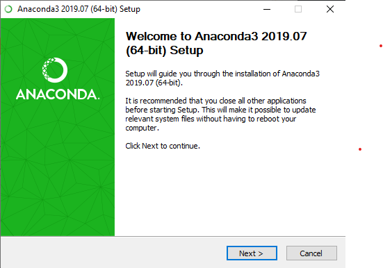
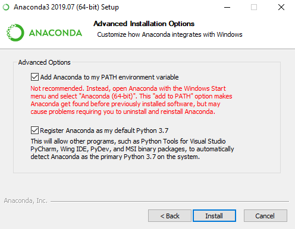
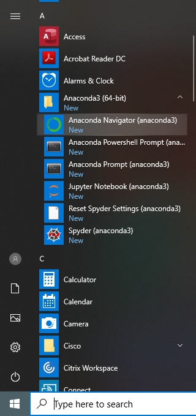

# Python Setup

## Setup Anaconda
1. We can download it from Acavonda Website (https://www.anaconda.com/distribution/)
2. Click on download and select the operating system.
3. After download, start the setup and click on Next.
4. During the setup, select the `Add Anaconda to my PATH enviroment variable` and click next.  
5. Now we can start with Anaconda, search `Anaconda Navigation` in Start and open it.
 

## How to run the program

1. Create a file with `.py` extension
2. Open terminal and go to directory where the file is created.
3. 